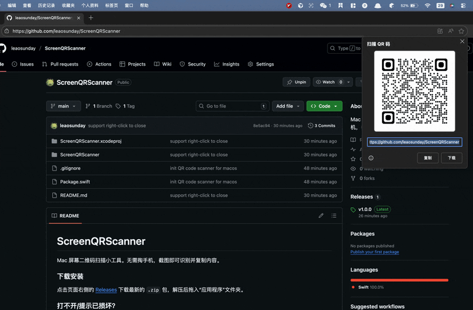

# ScreenQRScanner

| <a href="./README.md"><b>English</b></a> | <b>简体中文</b> |

Mac 屏幕二维码扫描小工具。无需掏手机，截图即可识别并复制内容。

### 使用示例

### 下载安装
点击页面右侧的 [Releases](../../releases) 下载最新的 `.zip` 包，解压后拖入“应用程序”文件夹。

### 打不开/提示已损坏？
因为没有苹果开发者签名，首次运行**必须**按照以下步骤：
1. 在“应用程序”文件夹里找到 App。
2. **右键点击**图标 -> 选择 **“打开”**。
3. 在弹窗中点击 **“打开”**。

### 如何使用
*   **快捷键**：`Cmd` + `Shift` + `X` 唤起扫描。
*   **退出应用**：右键菜单栏图标退出。
*   **关闭弹窗**：按 `ESC` 关闭弹窗。
